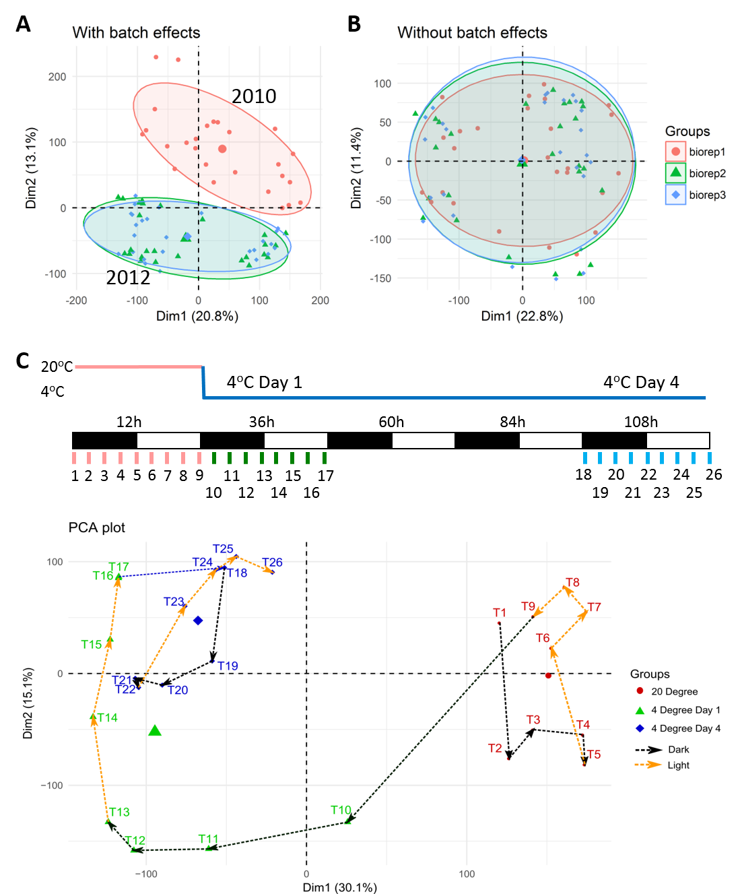

---
output:
  html_document: default
  word_document: default
---

PCA is a mathematical method to reduce expression data dimensionality while retaining most of the data variance. The reduction is performed by projecting the data to directions or principal components (PCs) from highest to lowest data variability. Therefore, the data main variance is accessible by investigating top few numbers of PCs rather than thousands of variables. In Omic data analysis, the first two to four principal components are often used to visualise the similarities and differences of samples, thereby determining the grouping of samples. In the PCA scatter plot, the samples from the same condition often stay close to one another, but are separated from samples of other conditions. It can be used as evidence for data quality checking.

The PCA plot can also be used to identify whether the RNA-seq data contains batch effects, which are caused by biological replications being prepared in different, for example, laboratory conditions. Compared with random noise, batch effects can be distinguished due to the systematic biases of signals across replicates. For example, the PCA plot Figure A shows that biological replicate 1 (brep1; samples were harvested in year 2010) is partitioned in a separate cluster to the other two replicates (samples were harvested in year 2012), which indicates a clear batch effect of the data. The RUVSeq R package (Risso et al., 2014) is used to estimate the batch effects. The RUVSeq algorithm generates batch effect terms which can be incorporated in the design matrix of linear regression model for 3D analysis, i.e.

$$ \text{observed expression = baseline effects + batch effects + noise} $$

It also generates a pseudo read count matrix in which the batch effects have been removed from the data. To avoid data over-modification, this matrix is only used to make PCA plot, but not used for downstream 3D analysis (Figure B).

In this panel, users can select and visualise different PCs based on transcript level or gene level expression of all samples (Figure A and Figure B), or the average expression of biological replicates (Figure C). The scatter points can be grouped and coloured according to different factors. Ellipses or polygons can be added to the plots to highlight the grouped clusters.

**NOTE**: The batch effect estimation step is only executed when there are distinct bath effects in the data:

- The biological replicates of the same conditions stay in separate clusters in the PCA plot.
- There is experimental explanation of this separation (e.g. bio-reps in different time/labs).

Otherwise skip this step to avoid data over-modification.

<!---->

**Figure**: PCA plots of transcript level expression. The RNA-seq data is from Calixto et al. (2018), which is a study of Arabidopsis in response to cold. In the experiment, 5-week-old plants were firstly placed at $20^oC$, then transited to $4^oC$. Samples were taking very 3 hours at $20^oC$, $4^oC$ Day 1 of transition and $4^oC$ Day 4 of acclimation, yielding 26 time-points in total (Figure C). The experiments were repeated in three biological replicates (one biological replicate was harvested in 2010 and the other two were harvested in 2012). (A) and (B) are the PCA plots of 78 samples (26 time-points x 3 biological replicates). No adjustment of batch effects was applied to the dataset in (A) while the batch effects of biological replicates in (B) were removed from the data. (C) is the PCA plot of average expression across 26 time-points.

### References
Calixto,C.P.G., Guo,W., James,A.B., Tzioutziou,N.A., Entizne,J.C., Panter,P.E., Knight,H., Nimmo,H., Zhang,R., and Brown,J.W.S. (2018) Rapid and dynamic alternative splicing impacts the Arabidopsis cold response transcriptome. Plant Cell, tpc.00177.2018.

Risso,D., Ngai,J., Speed,T.P., and Dudoit,S. (2014) Normalization of RNA-seq data using factor analysis of control genes or samples. Nat. Biotechnol., 32, 896–902.

