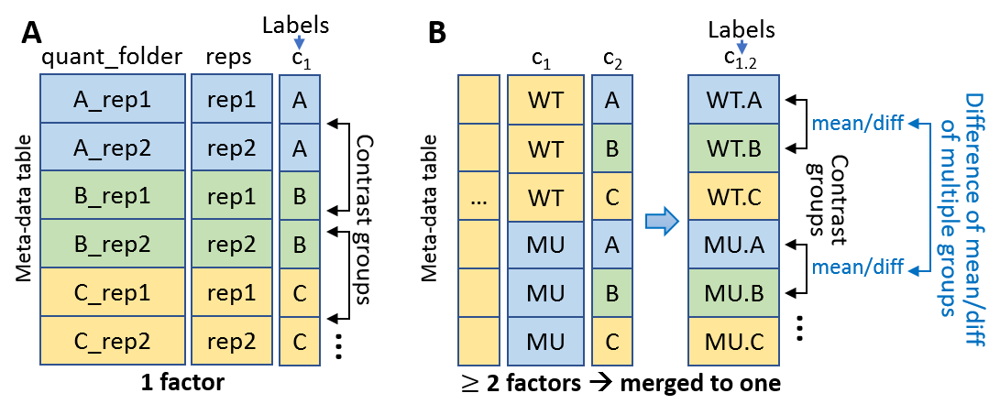

---
output:
  word_document: default
  html_document: default
---

Once the "csv" spreadsheet of sample information is uploaded, users can select columns of factors to distinguish the categories of different samples. The columns of following information must be selected:

-	One or more factors relevant to experimental design of expression changes (Figure A and B).
-	Biological replicates (bio-reps).
-	Sequencing replicates (seq-reps) if they exist.
-	Sample-based folder name of Salmon/Kallisto quantification (“quant_folder” column in Figure A).

New columns will be created to distinguish samples:

- quant.path: the full path of "quant.sf" files of Salmon or "abundance.h5"/"abundance.tsv" files of Kallisto.
- sample.name: sample names will be set as condition.bio-reps.seq-reps (if seq-reps exist; Figure A).
- condition: a column of factor labels. If two or more factor columns are selected, they will be merged to one column. For example, samples were taken from wild-type (WT) and mutant (MU) groups (one column) and each group have 3 treatment A, B and C (another column). Condition of interest will be set as WT.A, WT.B, WT.C, MU.A, MU.B and MU.C (Figure B).

<!---->

**Figure**: Samples and factors to distinguish sample categories. Conditions of interest are relevant to (A) one factor and (B) two or more than two factors. 
